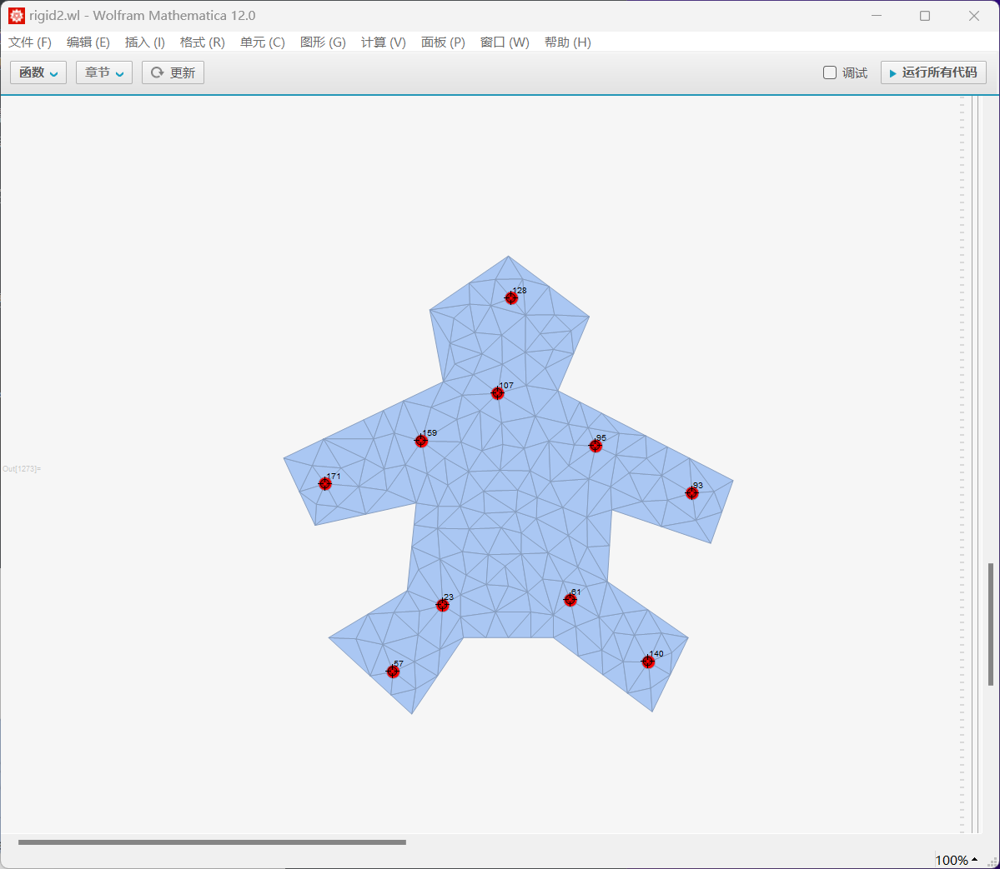
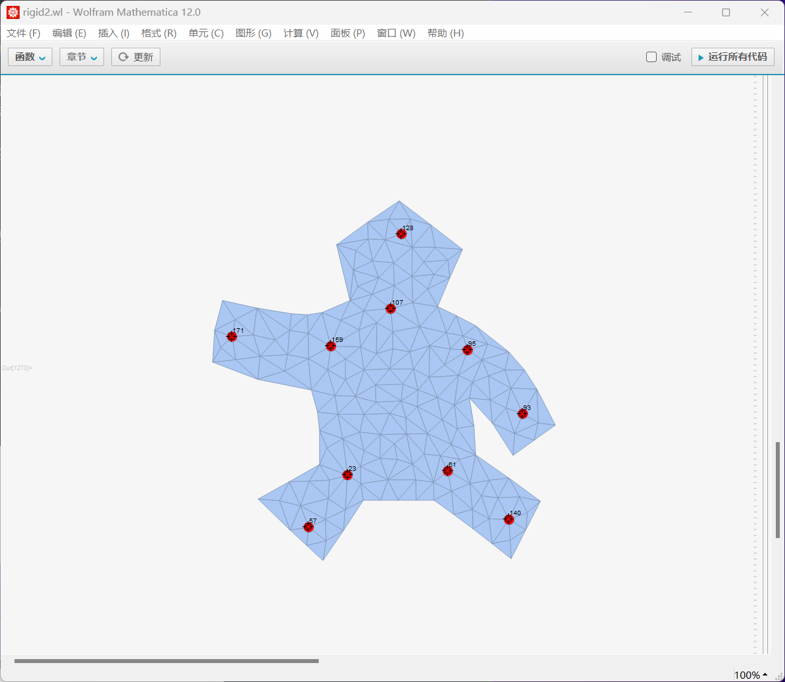
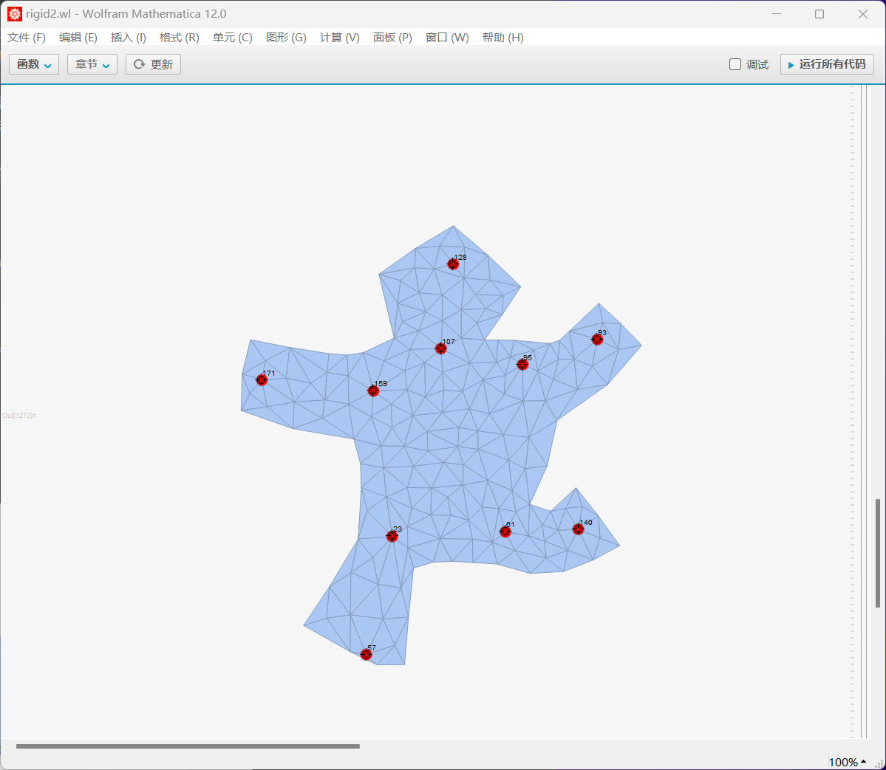
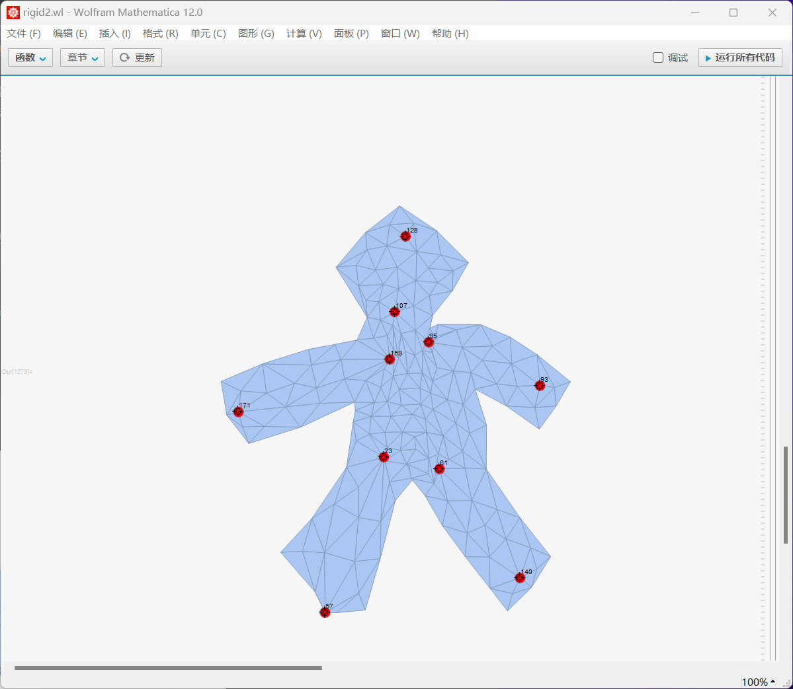

# 报告

这是一篇有趣的论文，让我想起来live2d技术中的图图形扭曲（[live2D官方基本教程_哔哩哔哩_bilibili](https://www.bilibili.com/video/BV1JE411Y7Te?p=3&vd_source=c2da37f9635acbe91e5ff73e021e4afc)，2:47）。没想到会有自己亲手将其实现的一天。由于整个学习持续了一个多月的时间，我会将思考过程、体会、论文解读交织在一起书写此次的报告。

论文介绍了一种使用三角网格，使得可以像扭曲物体一样扭曲图像的方法。算法分为两个步骤：scale-free construction和scale adjustment。前着通过最小化每个三角形的error总和使每个单元的变化尽可能小；后者再重新调整每个三角形的面积来防止拉伸后面积的过度变化。

## Step One：结构变化程度的估计

第一部分的数学部分比较容易理解。先是通过记录原图中每个三角形的形状，以相对坐标的形式储存在$x$和$y$中；随着vertex的移动，最小化每个free vertex与其期望处于的位置之距离，就能求得这些free vertex的最佳位置。由于“距离”是一个关于坐标的二次多项式，那么就可以写成一个二次型。将系数矩阵拆分成free vertex和fixed vertex的部分后，只需一次性求一个矩阵的逆，就能够一劳永逸，用其快速计算出free vertex的最佳位置。

然而，简单的数学过程中却蕴含着复杂的实现方法。我面临如下几个问题：

1. 如何将一个图形变成triangular mesh？我搜遍google和python也没有找到易于理解和操作的方法。
2. 如何处理一个数百个变量的多项式，并精准记录变量的顺序，求出这个系数矩阵？关键是，在运用此矩阵时还需要和原来的vertex一一对应起来。
3. 如何实现可视化？若用python的图形库手写一个可以拖动节点的可视化程序，太过麻烦。况且，每一次调整节点都可能经过计算和各种for循环，自己手写可视化难以保证执行效率，并且有本末倒置的感觉——重点应该是研究manipulation算法。

由于以上几个问题，我迟迟不知道如何动手，尝试在电脑前坐数小时一筹莫展。就这样，暑期学期过后的暑假中，我也没有再理会这个问题。直到大二开学后，我从网友分享中得知mathematica似乎在图像处理与可视化上有独特的优势，于是便开始尝试学习mathematica。另外，我又想到不知道如何处理大型多项式可能是因为不熟悉mesh的数据结构，导致无法建立起cell之间的联系。我听说Fundamentals of Computer Grafics是图形学圣经，便找来看看，其中果然有讲mesh数据结构的例子。

经过3天的边学边做，上述问题都得到了很好的解决。

这里以一个飞镖的形状为例。首先是生成网格，这一点对于mathematica来说非常容易，因为其内置了Delaunay mesh。

```mathematica
(*generate the mesh*)
\[ScriptCapitalR] = MeshRegion[{{0, 0}, {2, -1}, {1, 0}, {2, 1}}, Polygon[{1, 2, 3, 4}]];
mesh = TriangulateMesh[\[ScriptCapitalR], MeshQualityGoal->"Maximal"]
nv = Length[MeshCells[mesh,0]];  (*number of vertice*)
nt = Length[MeshCells[mesh,2]];  (*number of triangles*)
```

还能直接显示图片。


接着计算并储存带有三角形形状信息的相对坐标。


这里独特的函数式编程与新奇的映射方法很有趣。

```mathematica
(*Compute the coefficients in each triangle. 
Notice that the order of vertice in each triangle is counterclockwise, 
so if we store the coefficients in an right order, it will work well.*)
computeXAndY = {(#2-#1).(#3-#1)/Norm[#2-#1]^2,Det[{#2-#1,#3-#1}]/Norm[#2-#1]^2}&;
computeCoef[v1_,v2_,v3_]:={computeXAndY[v2,v3,v1],computeXAndY[v3,v1,v2],computeXAndY[v1,v2,v3]};
coefficientsInEachTriangle = (computeCoef@@Part[#,1])&/@MeshPrimitives[mesh,2];
```

接着设置想要固定的节点。

```mathematica
fixedVertice = {2,4,30,41,74};
nfixed=Length[fixedVertice];  (*number of fixed vertice*)
nfree=nv-nfixed;
```

接下来开始求G


mathematica直接对数学表达式进行操作（“所见即所得”）的特性，使得系数矩阵也十分容易求。需要注意的只剩相乘时vertex向量的顺序问题。

```mathematica
(*In following steps, we aim to obtain matrix G of (5) in the paper*)
error[v0_,v1_,v2_,x_,y_]:=(v0+x (v1-v0)+y({{0,-1},{1,0}}.(v1-v0))-v2).(v0+x (v1-v0)+y({{0,-1},{1,0}}.(v1-v0))-v2);  (*(4) in the paper*)
verticeIndexes=Array[#&,nv];
(*use 2*nv variables to obtain the polynomial of error, and compute its coefficients matrix*)
variablesOfFreeVertice=Flatten[{Subscript[v,#,"x"],Subscript[v,#,"y"]}&/@Select[verticeIndexes,!ContainsAll[fixedVertice,{#}]&]];
variablesOfFixedVertice=Flatten[{Subscript[v,#,"x"],Subscript[v,#,"y"]}&/@Select[verticeIndexes,ContainsAll[fixedVertice,{#}]&]];
errorOf3OrderedVertice[i_,j_,k_,x_,y_]:=error[
	{Subscript[v,i,"x"],Subscript[v,i,"y"]},
	{Subscript[v,j,"x"],Subscript[v,j,"y"]},
	{Subscript[v,k,"x"],Subscript[v,k,"y"]},
	x,y
];
errorOfATriangle[index_]:=Module[
	{coefi=coefficientsInEachTriangle[[index]],indexesOfVertice=MeshCells[mesh,2][[index]][[1]]},
	errorOf3OrderedVertice@@Join[RotateLeft[indexesOfVertice,1],coefi[[1]]]+
	errorOf3OrderedVertice@@Join[RotateRight[indexesOfVertice,1],coefi[[2]]]+
	errorOf3OrderedVertice@@Join[indexesOfVertice,coefi[[3]]]
];
thePolynomial=Total[errorOfATriangle/@Array[#&,nt]];
gInFormular5=CoefficientArrays[thePolynomial,Join[variablesOfFreeVertice,variablesOfFixedVertice]][[3]];

(*obtain G00 and G01*)
G=gInFormular5+Transpose[gInFormular5];
G00=Take[G,{1,2nfree},{1,2nfree}];
G01=Take[G,{1,2nfree},{2nfree+1,2nv}];
amazingMetrix=Inverse[G00].G01;
```


然后根据上图实现动态可视化即可。

```mathematica
DynamicModule[
	{newFixedVerticeCoordinate=MeshPrimitives[mesh,0][[#]][[1]]&/@fixedVertice},  (*map new vertice to the mesh*)
	LocatorPane[
		Dynamic[newFixedVerticeCoordinate],
		Dynamic[
			u=-amazingMetrix.Flatten[newFixedVerticeCoordinate];
			newVerticeCoordinate=ArrayReshape[u,{nfree,2}];
			For[i=1,i<=nfixed,i++,newVerticeCoordinate=Insert[newVerticeCoordinate,newFixedVerticeCoordinate[[i]],fixedVertice[[i]]];];
			MeshRegion[
				newVerticeCoordinate,
				Triangle/@(#[[1]]&/@MeshCells[mesh,2]),
				MeshCellHighlight->(({0,#}->Red)&)/@fixedVertice,
				MeshCellLabel->(({0,#}->"Index")&)/@fixedVertice,
				MeshCellShapeFunction->(({0,#}->(Disk[#,0.03]&))&)/@fixedVertice,
				PlotRange->{{-0.5,2.5},{-1.5,1.5}},
				ImageSize->Full
			]
		]
	]
]

```

效果如下

<video src="rigid2.wl _ - Wolfram Mathematica 12.0 2022-09-12 22-01-34.mp4"></video>

可以看出，除了拉伸时三角形会长胖以外，效果十分不错。接下来进入第二步的实现。

## Step Two：尺寸调整

Step two也分为两部分：首先将最初的三角形全等地放置到Step1中拉伸过后的位置，然后再通过用新的位置最小化error来计算最终顶点的位置。在熟悉了mesh数据结构后，Step two仅用了一天半就完成了。

第一部分，保证局部三角形的全等。


```mathematica
(*the coordinates had been worked out*)
fittedVerticeInATriangle[x_,y_,v0newx_,v0newy_,v1newx_,v1newy_,v2newx_,v2newy_]:=Module[{
	v0x=-(-v0newx-v2newx+v1newx x+v2newx x-v0newx x^2-v1newx x^2-v1newy y+v2newy y-v0newx y^2-v1newx y^2)/(2 (1-x+x^2+y^2)),
	v0y=-(-v0newy-v2newy+v1newy x+v2newy x-v0newy x^2-v1newy x^2+v1newx y-v2newx y-v0newy y^2-v1newy y^2)/(2 (1-x+x^2+y^2)),
	v1x=-(-2 v1newx+v0newx x+2 v1newx x-v2newx x-v0newx x^2-v1newx x^2+v0newy y-v2newy y-v0newx y^2-v1newx y^2)/(2 (1-x+x^2+y^2)),
	v1y=-(-2 v1newy+v0newy x+2 v1newy x-v2newy x-v0newy x^2-v1newy x^2-v0newx y+v2newx y-v0newy y^2-v1newy y^2)/(2 (1-x+x^2+y^2))
},
	{{v0x,v0y},{v1x,v1y},{v0x,v0y}+x ({v1x,v1y}-{v0x,v0y})+y {{0,-1},{1,0}}.({v1x,v1y}-{v0x,v0y})}
]
normOfFirstVectors=Array[Norm[MeshPrimitives[mesh,2][[#]][[1]][[2]]-MeshPrimitives[mesh,2][[#]][[1]][[1]]]&,nt];
scaledTriangle[fittedTriangle_,i_]:=ScalingTransform[{normOfFirstVectors[[i]],normOfFirstVectors[[i]]}/Norm[fittedTriangle[[2]]-fittedTriangle[[1]]],Total[fittedTriangle]/3][fittedTriangle];
```


由于这是一个简单的线性方程组，新的坐标可以直接解出来，然后等比缩放回原大小就行了。此处经过资料查阅，缩放时位似中心选为三角形重心较合适，这是论文里没有指出的。

第二部分，保证整体的损失最小。


接下来就是求解新error函数的最小值，与之前如出一辙。

```mathematica
(*the same as how we obtain G*)
variablesOfFreeVertice2=Flatten[{Subscript[v',#,"x"],Subscript[v',#,"y"]}&/@Select[verticeIndexes,!ContainsAll[fixedVertice,{#}]&]];
variablesOfFixedVertice2=Flatten[{Subscript[v',#,"x"],Subscript[v',#,"y"]}&/@Select[verticeIndexes,ContainsAll[fixedVertice,{#}]&]];
variablesOfVerticefitted=Flatten[Array[{Subscript[vf,#,0,"x"],Subscript[vf,#,0,"y"],Subscript[vf,#,1,"x"],Subscript[vf,#,1,"y"],Subscript[vf,#,2,"x"],Subscript[vf,#,2,"y"]}&,nt]];
square = (#.#)&;
E2[i_]:=Module[
{indexOfv0=triangleCells[[i]][[1]][[1]],indexOfv1=triangleCells[[i]][[1]][[2]],indexOfv2=triangleCells[[i]][[1]][[3]]},
	vp0={Subscript[v',indexOfv0,"x"],Subscript[v',indexOfv0,"y"]};
	vp1={Subscript[v',indexOfv1,"x"],Subscript[v',indexOfv1,"y"]};
	vp2={Subscript[v',indexOfv2,"x"],Subscript[v',indexOfv2,"y"]};
	vf0={Subscript[vf,i,0,"x"],Subscript[vf,i,0,"y"]};
	vf1={Subscript[vf,i,1,"x"],Subscript[vf,i,1,"y"]};
	vf2={Subscript[vf,i,2,"x"],Subscript[vf,i,2,"y"]};
square[vp1-vp0-vf1+vf0]+square[vp2-vp1-vf2+vf1]+square[vp0-vp2-vf0+vf2]
]

coef2=CoefficientArrays[Total[Array[E2,nt]],Join[variablesOfFreeVertice2,variablesOfFixedVertice2]];
H=coef2[[3]];
matrixHp=Take[H+Transpose[H],{1,2nfree},{1,2nfree}];  (*important*)
inverseHp=Inverse[matrixHp];
matrixD=G01=Take[H+Transpose[H],{1,2nfree},{2nfree+1,2nv}];  (*important*)
f=coef2[[2]];
f0=Take[f,2nfree];  (*important*)
```

经过上述所有流程，最终就是as rigid as possible的图形操作了。效果如下：

<video src="rigid2.wl - Wolfram Mathematica 12.0 2022-09-13 22-04-40.mp4"></video>

其中，红色部分是Step one的结果；灰色部分是原图像小三角形重新分配的位置；蓝色部分是最终结果。

对下图的小人使用同样的方法（图1是初始状态）

 



## 感想

与之前的possion图像编辑与grabcut不同，这篇论文所用到的几何学知识不过是初中内容，线性代数与微积分知识也只是入门级别，但效果却十分出众，颇有趣味。看来，好的想法就是用简单的工具解决复杂的问题。ARAP的精妙之处在于使用了二次函数来表示图像变换前后的差异，这在选中fixed tertice的时候就能够做完大部分计算，极大减少了调整节点的时候的运算量。论文中提到，当时主流的图像操作有两部分，分别是扭曲空间和基于物理性质的扭曲图像本身，而ARAP方法属于第二类。物体分子之间的引力本身就带有“最小化整体变化”的性质，这也许就是本文指导思想的来源。由此观之，联想出一种基于熟悉的物体的“模拟算法”应用于未知领域，是一种不错的思考方法。

为了复现这篇论文，我不仅学习了mathematica这一强大的数学计算工具，还见识了不同于面向对象编程，而更贴合数学思维的语言设计思想。今后其也会称为我研究的有力工具。此外，一次又一次挑战之前的“做不到”带来的爽快感也非同小可。每当觉得走投无路时，总有各种各样的任务或者书本指引我在某个领域了解更多，更加熟悉，不知不觉原来做不到的事情都能做到了。这比高中、或者任何一次为了考试高分而学习的过程都更能体现“世上无难事，只要肯攀登”的道理。期待下一篇与我邂逅的文章。
